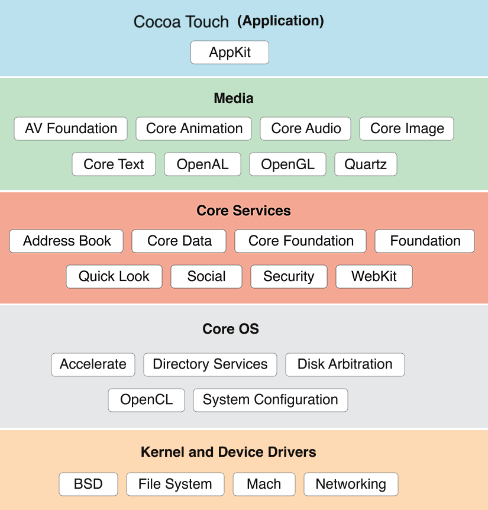

iOS操作系统除过最底层的内核，其上总共为四层，从上到下依次是：

- AppKit
- Media
- Core Services
- Core OS

在最底层的内核，主要用来控制硬件、定时、文件系统、中断、驱动和电源管理等。

在Core OS层，主要对其下的内核层内容进行适当抽象，比如OpenCL，磁盘访问。

在Core Services层，提供了一些核心服务，比如数据的抽象Core Data，动画Core Animation，浏览器内核WebKit，编程语言基础Core Foundation，以及安全服务等。

在Media层，主要为媒体类提供支持，比如音视频、文本、图片和动画等，会在屏幕上显示的所有内容都在这一层。

在最上层的AppKit，将下面所有层提供的服务合在一起，并且加上所有动态库和运行时能力，为应用程序提供完整的服务。