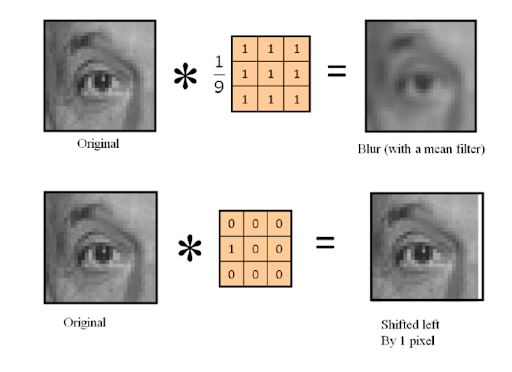

# 简介

Core Image是一个图片处理及分析库，里面封装了非常易用的API，比如大量常用滤镜。因为它借助GPU或者CPU渲染，所以可以接近实时的速度处理静态图片和视频图片，图片可来自Core Graphics、Core Video以及I/O框架。

## 功能列表

Core Image提供的能力包括：
- 通过大量内置滤镜处理图片
- 通过滤镜链自定义处理效果
- 自动化图片增强
- 特征检测，比如人脸、矩形、文字等
- 创建自定义滤镜

## 基本概念
### 滤镜

一个滤镜在语义上表示某种能力，当作用在一张图片上时，可以经过某种变换从而得到另一张图片。

我们都知道，图片在计算机中是以像素为基本单位而保存的像素矩阵，通过图像处理单元GPU才能将其显示在屏幕上。在数学上，滤镜其实也是一个矩阵，也叫卷积核，通常比图片的像素矩阵维度小得多。在真正处理图片时，图片像素矩阵和卷积核做卷积运算，最终输出一个“新”图片。



### 滤镜链

顾名思义，滤镜链就是将多个滤镜链接在一起，前一个滤镜的输出作为下一个滤镜的输入，就像流水线一样，图片从第一个滤镜中进入，处理之后再进入下一个，一直到最后一个滤镜。通过这种方式，可以创建出更加如何需求的效果。

但实际上，Core Image的处理逻辑有点不同，它并不会让一张图片经过多次处理。为了性能考虑，Core Image会先将多个滤镜的卷积核合成为一个，然后一次性得出最终的结果。

# 图片处理

简单来说，图片处理就是将某张图片作用于某个滤镜的过程。

在Core Image中，图片为CIImage，滤镜为CIFilter，为滤镜设置参数要通过KVC实现。同时，还需要一个上下文对象CIContext，里面保存着所有相关的细节。因为这些细节非常多，所以最好在合适的时机创建一个可重复利用的CIContext对象。

## 单滤镜

最基本的用法就是只使用单个滤镜，如下所示。

```objc
- (void)blurImageWithRadius:(CGFloat)radius {    
    UIImage *originalImage = [UIImage imageNamed:@"blackboard.jpg"];
    CIImage *ciimage = [CIImage imageWithData: UIImageJPEGRepresentation(originalImage, .9)];
    
    CIFilter *gaussianBlur = [CIFilter filterWithName:@"CIGaussianBlur"];
    [gaussianBlur setValue:@(radius) forKey:@"inputRadius"];
    [gaussianBlur setValue:ciimage forKey:@"inputImage"];
    
    [self.processedImageView setImage:[UIImage imageWithCIImage:gaussianBlur.outputImage]];
}
```

在CoreImage中所有相关操作中只能使用CIImage这个格式，但是它并不能直接作为展示来用，因为CIImage只是一种用来生产图片的“配方”，其实就是一种操作流程，比如从URL读取图片文件，某个滤镜操作的输出等，只有在渲染或者输出时才会开始执行。总结下来，可以通过下面这些方法创建CIImage：

- NSURL
- NSData
- UIImage
- CGImageRef
- CVImageBufferRef
- CIImageProvider

```objc
- (void)createCIImageMethods {
    CIImage *ciimg;
    
    // 1. URL
    ciimg = [[CIImage alloc] initWithContentsOfURL:[NSURL URLWithString:@"some-url"]];
    
    // 2. bytes
    ciimg = [CIImage imageWithData:[NSData dataWithContentsOfFile:@"some-file-path"]];
    
    // 3. UIImage
    ciimg = [CIImage imageWithData:UIImageJPEGRepresentation([UIImage imageNamed:@"some-img-name"], .9)];
    ciimg = [CIImage imageWithData:UIImagePNGRepresentation([UIImage imageNamed:@"png-name"])];
    
    // 4. CGImageRef
    ciimg = [CIImage imageWithCGImage:[UIImage imageNamed:@"some-img"].CGImage];
    
    //...
}
```

## 滤镜链

前面说了，当要经过多个滤镜的处理时，CoreImage为了提高性能会将多个滤镜合成为一个，并在合适时机完成处理。

例如，如果分步处理，其流程如下：


但如果合成为一个Filter，则其流程如下：


```objc
- (CIImage *)processWithImage:(CIImage *)image fileterName:(NSString *)name params:(NSDictionary *)params {
    CIFilter *filter = [CIFilter filterWithName:name];
    [filter setValue:image forKey:@"inputImage"];
    for (NSString *key in params.allKeys) {
        [filter setValue:params[key] forKey:key];
    }
    return filter.outputImage;
}

- (IBAction)startProcessWithChain:(UIButton *)sender {
    CIImage *blurImg, *bloomImg, *croppedImg;
    blurImg = [self processWithImage:self.inputImage
                         fileterName:@"CIGaussianBlur"
                              params:@{kCIInputRadiusKey: @(1.2)}];
    bloomImg = [self processWithImage:blurImg
                          fileterName:@"CIBloom"
                               params:@{kCIInputRadiusKey: @(8.0),
                                        kCIInputIntensityKey: @(1.0)}];
    croppedImg = [bloomImg imageByCroppingToRect:CGRectMake(50, 100, 300, 300)];
    
    [self.processedImageView setImage:[UIImage imageWithCIImage:croppedImg]];
}
```

