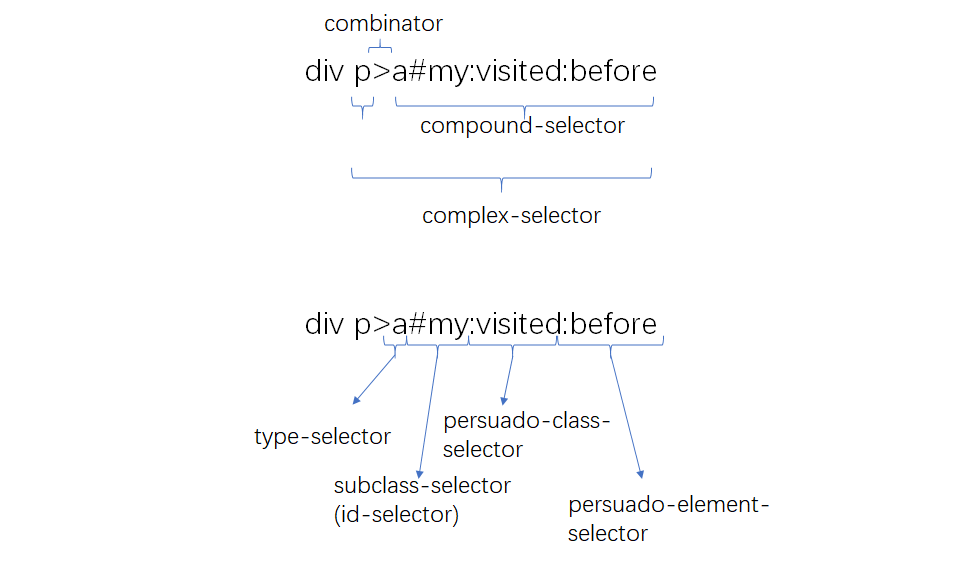

# CSS语法
根据相关标准我们可以得知，CSS顶层样式表由两种规则组成：
- at-rule，也就是at规则。由一个 `@` 关键字和后续的一个区块组成，如果没有区块，则以分号结束。这些at-rule在开发中使用机会远远小于普通的规则。
- qualified rule，也就是普通规则，在工作中主要使用此类。

## at规则
 at规则虽然在工作中使用的频率远远小于普通规则，但是这些at规则正是掌握CSS的一些高级特性所必须的内容。下面就是从所有的CSS标准里找到所有可能的 at-rule：
- @charset ： https://www.w3.org/TR/css-syntax-3/
- @import ：https://www.w3.org/TR/css-cascade-4/
- @media ：https://www.w3.org/TR/css3-conditional/
- @page ： https://www.w3.org/TR/css-page-3/
- @counter-style ：https://www.w3.org/TR/css-counter-styles-3
- @keyframes ：https://www.w3.org/TR/css-animations-1/
- @fontface ：https://www.w3.org/TR/css-fonts-3/
- @supports ：https://www.w3.org/TR/css3-conditional/
- @namespace ：https://www.w3.org/TR/css-namespaces-3/

### @charset
用于提示CSS文件使用的字符编码方式，它如果被使用，**必须出现在最前面**。这个规则只在给出语法解析阶段前使用，并不影响页面上的展示效果。
```css
@charset "utf-8";
```
### @import
用于引入一个CSS文件，除了`@charset`规则不会被引入，`@import`可以引入另一个文件的全部内容。注意：这些规则必须先于所有其他类型的规则。
```css
@import [ <url> | <string> ]
        [ supports( [ <supports-condition> | <declaration> ] ) ]?
        <media-query-list>? ;
```
```css
@import "some-style.css";
@import url("url-of-some-style.css");
@import url("fineprint.css") print;
@import url("bluish.css") projection, tv;
@import url('landscape.css') screen and (orientation:landscape);
```

### @media
media query能够对设备的类型进行一些判断。在media的区块内，是普通规则列表。media types如下：
- all：适合所有设备；
- print：适合在打印预览模式下的可分页材料和文件；
- screen：屏幕设备；
- speech：Intended for speech synthesizers。
```css
@media print {
    body { font-size: 10pt }
}
/* At the top level of your code */
@media screen and (min-width: 900px) {
  article {
    padding: 1rem 3rem;
  }
}

/* Nested within another conditional at-rule */
@supports (display: flex) {
  @media screen and (min-width: 900px) {
    article {
      display: flex;
    }
  }
}
```
### @page
用于分页媒体访问网页时的表现设置，页面是一种特殊的盒模型结构，除了页面本身，还可以设置它周围的盒。
```css
@page {
  size: 8.5in 11in;
  margin: 10%;

  @top-left {
    content: "Hamlet";
  }
  @top-right {
    content: "Page " counter(page);
  }
}
```
### @counter-style
用于定义列表项的表现。可定义的项目有：system，negative，prefix，suffix，range，pad，symbols等。
```css
@counter-style triangle {
  system: cyclic;
  symbols: ‣;
  suffix: " ";
}
```
### @keyframes
产生一种数据，用来定义动画关键帧。
```css
@keyframes diagonal-slide {
  from {
    left: 0;
    top: 0;
  } /* 0% */

  to {
    left: 100px;
    top: 100px;
  } /* 100% */
}
```
完全根据百分比定义：
```css
@keyframes identifier {
  0% { top: 0; left: 0; }
  30% { top: 50px; }
  68%, 72% { left: 50px; }
  100% { top: 100px; left: 100%; }
}
```
### @font-face
用于定义一种字体，icon font技术就是利用这个特性来实现的。描述符有：font-display、font-family、font-stretch、font-style、font-weight等。
```css
@font-face {
  font-family: "Open Sans";
  src: url("/fonts/OpenSans-Regular-webfont.woff2") format("woff2"),
       url("/fonts/OpenSans-Regular-webfont.woff") format("woff");
}
```
### @supports
用于检查环境是否满足一定条件，然后指定具体的样式，和media比较相似。
```css
@supports (display: grid) {
  div {
    display: grid;
  }
}
@supports not (display: grid) {
  div {
    float: right;
  }
}
@supports not (not (transform-origin: 2px)) {}
@supports (display: grid) and (not (display: inline-grid)) {}
```
### @namespace
用于跟XML命名空间配合的一个规则，表示内部的CSS选择器全都带上特定命名空间。
### @viewport
用于设置视口的一些特性，不过兼容性目前不是很好，多数时候被html的meta代替。

## 普通规则
普通规则主要有选择器和声明区块组成，声明区块又由属性和值组成，值既可以是具体的数值，也可以是函数。
- 选择器
- 声明列表
    - 值
        - 值的类型
        - 函数

### 选择器selector
任何选择器，都是由几个符号结构连接的：空格、大于号、加号、波浪线、双竖线组成。

然后，对每一个选择器来说，如果它不是伪元素的话，由几个可选的部分组成，标签类型选择器，id、class、属性和伪类，它们中只要出现一个，就构成了选择器。如果它是伪元素，则在这个结构之后追加伪元素。只有伪类可以出现在伪元素之后。

- combinator
    - 空格
    - `>`
    - `+`
    - `~`
    - `||`
- compound-selector
    - type-selector
    - subclass-selector
        - id
        - class
        - attribute
        - pseudo-class
    - pseudo-element



### 声明：属性和值
声明部分是一个由“属性:值”组成的序列。

#### 属性
**属性**是由中划线、下划线、字母等组成的标识符，CSS还支持使用反斜杠转义。需要注意的是：属性不允许使用连续的两个中划线开头，这样的属性会被认为是**CSS变量**。

在CSS标准中，以双中划线`--`开头的属性被当做变量，一直·与之配合的是`var`函数。
```css
/* :root匹配文档根元素。在 HTML 中，根元素始终是 html 元素。 */
:root {
  --main-color: #06c;
  --accent-color: #006;
}
/* The rest of the CSS file */
#foo h1 {
  color: var(--main-color);
}
```

#### 值和函数
**值**的部分，主要在标准 [CSS Values and Unit](https://www.w3.org/TR/css-values-4/)中，根据每个CSS属性可以取到不同的值，这里的值可能是字符串、标识符。

CSS属性值可能是以下类型：
- CSS范围的关键字：initial，unset，inherit，任何属性都可以的关键字。
- 字符串：比如content属性。
- URL：使用url() 函数的URL值。
- 整数/实数：比如flex属性。
- 维度：单位的整数/实数，比如width属性。
- 百分比：大部分维度都支持。
- 颜色：比如background-color属性。
- 图片：比如background-image属性。
- 2D位置：比如background-position属性。
- 函数：来自函数的值，比如transform属性。

一些属性会要求产生函数类型的值，比如`easing-function`会要求`cubic-bezier()`函数的值。CSS支持一批特定的计算型函数：

##### 一般运算
- calc()：基本的表达式计算，它支持加减乘除四则运算，还支持单位混合运算。例如：`width: calc(100%/3 - 2*1em - 2*1px);`；
- max()：最大值；
- min()：最小值；
- clamp()：给一个值限定一个范围，超出范围外则使用范围的最大或者最小值；
- toggle()：在规则选中多于一个元素时生效，它会在几个值之间来回切换，比如我们要让一个列表项的样式圆点和方点间隔出现，可以使用下面代码：`ul { list-style-type: toggle(circle, square); }`;
- attr()：用来获取被选中元素的属性值，并且在样式文件中使用。它也可以用在伪类元素里，在伪类元素里使用，它得到的是伪元素的原始元素的值。attr()函数可以和任何CSS属性一起使用，但是除了content外，其余都还是试验性的。
##### 图片滤镜filter
* blur()：高斯模糊；
* brightness()：调整亮度；
* contrast()：调整对比度；
* drop-shadow()：设置阴影效果；
* grayscale()：转换为灰度图像
* hue_rotate()：给图像应用色相旋转；
* invert()：反转图像；
* opacity()：设置图像透明度（0%完全透明，100%无变化）；
* saturate()：饱和度；
* cross-fade()：通过设置透明度混合多张图片在一起；
* element()：用于将网页某部分当做图像渲染；
* image-set()：根据用户设备的分辨率匹配合适的图像；
##### 颜色渐变效果
* conic-gradient()：圆锥形渐变；
* linear-gradient()：线性渐变；
* radial-gradient()：径向渐变；
* repeating-linear-gradient()：重复线性渐变；
* repeating-radial-gradient()：重复径向渐变。
* shape()
##### 几何变换transform
* matrix()：2d矩阵变换；
* matrix3d()：3d矩阵变换；
* perspective()：透视变换；
* rotate()：旋转；
* rotate3d()：3d旋转；
* rotateX()
* rotateY()
* rotateZ()
* scale()：缩放；
* scale3d()
* scaleX()
* scaleY()
* scaleZ()
* skew()：倾斜；
* skewX()
* skewY()
* translate()：平移；
* translate3d()
* translateX()
* translateY()
* translateZ()
