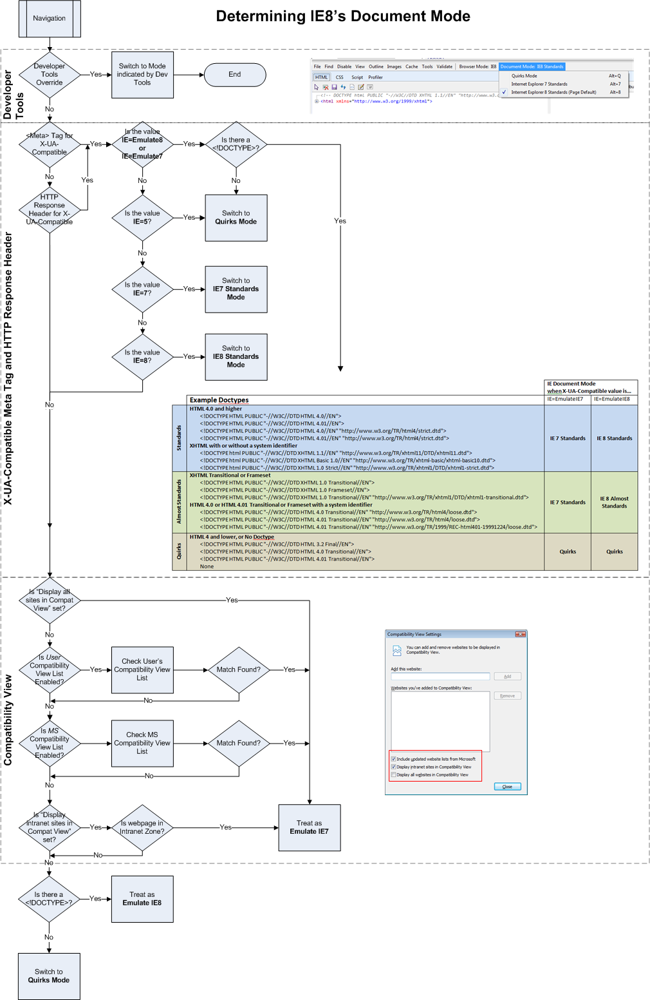
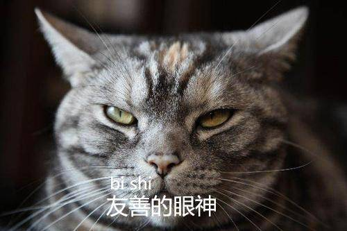

HTML标签可以分为很多种，比如：
- 元信息类；
- 语义类；
- 媒体替换类；
- 链接类等等。

虽然这部分知识看起来简单，但是却非常多，因此只能是”入门简单，精通困难“。

下面，我们先看看元信息类、语义类和媒体替换类标签都有哪些，已经如何使用。

# 元信息类标签

所谓元信息标签，就是用来描述自身信息的一类标签，通常出现在head标签中，一般不会显示在页面上。它们多是为浏览器和搜索引擎服务的，用于提升性能或者检索信息。

## head

`head`标签本身并不携带任何信息，它主要是作为盛放各种元信息标签、语义类标签的容器使用。规定head标签是html标签的第一个元素，并且`head`里面必须包含一个`title`。

## title

从字面上讲，**title**表示标题，但是`title`标签的含义却与此有点出入，它表示一个页面的精确概要信息，会作为页面标题显示在浏览器窗口上。另外，合理的`title`标签对SEO也有好处。

例如得到Web版：

```html
<title>得到APP - 知识就是力量，知识就在得到</title>
```

## meta

从**meta**的含义就知道，它表示元信息。`meta`标签是一组键值对，一般用`name`和`content`分别表示键和值，在`head`中可以出现多个`meta`标签。基本用法是这样的：

```html
<meta name=application-name content="StackOverflow">
```

上面的标签表示页面所在的Web应用名为StackOverflow。

### charset

从HTML5开始，为了简化写法，`meta`标签新增了`charset`属性。添加了`charset`属性的`meta`标签无需再有`name`和`content`。

```html
<html>
    <head>
        <meta charset="UTF-8">
    </head>
    <body>
    ...
    </body>
</html>
```

为了数据格式保持正确，建议将`charset`作为`head`的第一个标签。

### http-equiv

从字面上看，`http-equiv`即**http equivalent**，表示执行一条和HTTP头相关的指令，自然就不再需要`name`属性了。例如：

```html
<!-- 添加Content-Type -->
<meta http-equiv="content-type" content="text/html; charset=UTF-8">

<!-- 设置网页到期时间 -->
<meta http-equiv="expires" content="Wed, 20 Jun 2007 22:33:00 GMT"＞  

<!-- 每2秒刷新一次指定网页 -->
<meta http-equiv="Refresh" content="2；URL=http://www.net.cn/"＞

<!-- 设置cookie -->
<meta http-equiv="Set-Cookie" content="cookievalue=xxx;expires=Wednesday, 20-Jun-2007 22:33:00 GMT； path=/"＞

<!-- 设定进入、离开页面时的特殊效果 -->
<meta http-equiv="Page-Enter"    contect="revealTrans(duration=1.0,transtion=    12)">    
<meta http-equiv="Page-Exit"    contect="revealTrans(duration=1.0,transtion=12)">    

<!-- 清除缓存 -->
<meta http-equiv="cache-control" content="no-cache"> 

<!-- 设置关键字，有助于SEO -->
<meta http-equiv="keywords" content="keyword1,keyword2,keyword3">  

<!-- 设置页面描述 -->
<meta http-equiv="description" content="This is my page"> 

<!-- 设置IE兼容性，告诉IE该用哪个版本渲染，应该尽可能放在前面 -->
<meta http-equiv="X-UA-Compatible" content="IE=edge,chrome=1"> 
```



### viewport

`viewport`元信息标签虽然不是HTML标准定义的内容，但是却成为移动端Web开发的事实标准。它主要表示视口的属性，比如大小、缩放范围等。

```html
<meta name="viewport" content="width=device-width, initial-scale=1, maximum-scale=1">
```

所有属性包括：
- `width`：页面宽度，可以取值具体的数字，也可以是`device-width`，表示跟设备宽度相等。
- `height`：页面高度，可以取值具体的数字，也可以是`device-height`，表示跟设备高度相等。
- `initial-scale`：初始缩放比例。
- `minimum-scale`：最小缩放比例。
- `maximum-scale`：最大缩放比例。
- `user-scalable`：是否允许用户缩放。
- `minimal-ui`：Safari上隐藏地址栏和导航栏。

# 语义类标签

所有语言都是由各种不同的符号组成的，这些符号本身并没有任何含义，只有在被赋予一定含义之后才能被有效使用，这时候符号才能表达更多的信息，这就是语义。

>语义是我们说话表达的意思，多数的语义实际上都是由文字来承载的。语义类标签则是纯文字的补充，比如标题、自然段、章节、列表，这些内容都是纯文字无法表达的，我们需要依靠语义标签代为表达。

语义类标签主要承载着解释的功能，它们的视觉表现基本相同，主要是为了增加代码的可读性，不但可以让人读懂，也为了让机器知道其所表达的含义。比如：
- `nav`，表示导航相关信息；
- `section`，表示逻辑分区、分组等；
- `article`、`header`、`footer`等表示文档结构信息。

但是，在现代互联网产品中，HTML用于**描述软件界面多过于富文本**。

而在软件界面里，实际上几乎是没有语义的。因为软件界面面对的是用户，他们只对视觉表现感兴趣，通过完整有序的视觉表现，用户完全可以理解界面所表达的含义。比如在购物车中，每个商品就一定得用`ul`包起来吗？其实不然，经过精心设计的`div`和`span`完全可以胜任。

**不过，在很多场景，语义类标签有着无可替代的优点**
- 语义类标签对开发者更为友好，使用语义类标签增强了可读性，即便是在没有CSS的时候，开发者也能够清晰地看出网页的结构，也更为便于团队的开发和维护。
- 除了对人类友好之外，语义类标签也十分适宜机器阅读。它的文字表现力丰富，更适合SEO，也可以让搜索引擎爬虫更好地获取到更多有效信息，有效提升网页的搜索量，并且语义类还可以支持读屏软件，根据文章可以自动生成目录等等。

然而，无论在什么时候，对于“度”的把握都是一件不那么容易的事。用的太少、甚至不用无法充分利用语言的特性，用的太多又会造成累赘，降低性能。

## 自然语言类

### ruby
>语义标签的使用的第一个场景，也是最自然的使用场景，就是：作为自然语言和纯文本的补充，用来表达一定的结构或者消除歧义。

看这两张图片：




面对这种场景，用各种注释都达不到目的。因此在HTML5中，加入了`ruby`这样的标签，它由`ruby`、`rt`、`rp`三个标签来实现。

### em strong
比较下面几句话，感受其中的意思。

```
今天我吃了一个苹果。

昨天我吃了一个香蕉。
今天我吃了一个苹果。

昨天我吃了两个苹果。
今天我吃了一个苹果。
````
试着读一读，就会知道强调的是哪部分信息，有时候是**数量**的多少，而有时候是到**名称**。`em`就是用来强调语气的语义类标签。

而`strong`是在视觉表现上加强。所以，它和`strong`有着天壤之别。

## 结构类

### hgroup h1~h6 section

好的文章都是有结构的，比如中国古代小说中的”章-回“，西方戏剧中的”幕“。

在HTML中，同样也需要文章(档)结构类标签，比如`h`，`hgroup`，`header`等等，来表示文章的结构。对机器而言，这些标签会帮助生成一个树形结构目录，由各级标题组成。但是，这个结构和HTML的嵌套关系会有一定差异。

h1-h6是最基本的标题，它们表示了文章中不同层级的标题。有些时候，我们会有副标题，为了避免副标题产生额外的一个层级，我们使用hgroup标签。

从HTML 5开始，有了`section`标签，这个标签可不仅仅是一个**有语义的div**，它会改变`h1`-`h6`的语义。`section`的嵌套会使得其中的`h1`-`h6`下降一级，因此，在HTML5以后，我们只需要`section`和`h1`就足以形成文档的树形结构：
```HTML
<section>
    <h1>HTML语义</h1>
    <p>balah balah balah balah</p>
    <section>
        <h1>弱语义</h1>
        <p>balah balah</p>
    </section>
    <section>
        <h1>结构性元素</h1>
        <p>balah balah</p> 
    </section>
......
</section>
```
这段代码同样会形成前面例子的标题结构：
- HTML语义
    - 弱语义
    - 结构性元素
    - ……

### header aside footer article

随着越来越多的浏览器推出“阅读模式”，以及各种非浏览器终端的出现，语义化的HTML适合机器阅读的特性变得越来越重要。

应用了语义化结构的页面，可以明确地提示出页面信息的主次关系，它能让浏览器很好地支持“阅读视图功能”，还可以让搜索引擎的命中率提升，同时，它也对视障用户的读屏软件更友好。
```HTML
<body>
    <header>
        <nav>
            ……
        </nav>
    </header>
    <aside>
        <nav>
            ……
        </nav>
    </aside>
    <section>……</section>
    <section>……</section>
    <section>……</section>
    <footer>
        <address>……</address>
    </footer>
</body>
```
在这个结构中，`section`还可以和`header`、`aside`、`footer`进行深层次嵌套。除此之外，还可以使用`article`，表示一篇具有独立性质的文章，它和`body`比较相似。

一个典型的场景是多篇新闻展示在同一个新闻专题页面中，这种类似报纸的多文章结构适合用`article`来组织。

```HTML
<body>
    <header>……</header>
    <article>
        <header>……</header>
        <section>……</section>
        <section>……</section>
        <section>……</section>
        <footer>……</footer>
    </article>
    <article>
        ……
    </article>
    <article>
        ……
    </article>
    <footer>
        <address></address>
    </footer>
</body>
```
在这个结构中，出现的标签：
- `header`，如其名，通常出现在首部，表示导航或者介绍性的内容；
- `footer`，通常出现在尾部，包含有关作者、版权、相关链接等信息；
- `header`和`footer`通常是`body`和`article`的直接子元素；
- `aside`，表示跟文章主体不太相关的部分，可能包含导航、广告等工具性质的内容；
- `address`，经常被误用，真正表示的是文章（作者）的联系方式，而非给机器阅读的地址。

## 富文本类
### abbr dfn 

`abbr`表示缩写，例如WWW是World Wide Web的缩写，就该用下面的代码表示
```html
<abbr title="World Wide Web">WWW</abbr>.
```

`dfn`表示定义一个名词，在视觉表现上会按斜体显示，例如分别定义了Internet和World Wide Web，就应该这么使用
```html
The terms Internet and World Wide Web are often used without much distinction. However, the two are not the same. 
The <dfn>Internet</dfn> is a global system of interconnected computer networks.
In contrast, the <dfn>World Wide Web</dfn> is a global collection of documents and other resources, linked by hyperlinks and URIs. 
```

### figure figcaption

`figure`表示和文章相关的图表、图像、照片等流内容。里面可以和`img`、`p`等标签配合使用。
`figcaption`表示图表图像的标题。

```html
<figure style="float: right;">
    
    <figcaption>The NeXT Computer used by Tim Berners-Lee at CERN.</figcaption>
</figure>
```
其真实的显示效果如下：


### blockquote q cite

这三个标签都是和引述相关的。
- `blockquote`，表示段落级引述内容；
- `q`，表示行内的引述内容；
- `cite`，表示引述的作品名。

### pre samp code

这三个标签都表示按照特定格式进行排版，而不希望浏览器做过多的处理。
- `pre`，表示这部分内容是预先排版过的，不需要浏览器进行排版；
- `samp`，用来定义计算机程序的样本文本；
- `code`，表示代码。

```html
<pre><samp>
GET /home.html HTTP/1.1
Host: www.example.org
</samp></pre>
```

### 其他

|  标 签  |  含 义  |
| --- | --- |
| `small` | 之前表示字体缩小(已废弃)，HTML5表示补充评论。 |
| `s` | 之前表示划线(已废弃)，HTML5表示错误的内容，经常用于电商领域的打折价格。 |
| `i` | 之前表示斜体(已废弃)，HTML5表示读的时候变调。 |
| `b `| 之前表示黑体(已废弃)，HTML5表示关键字。 |
| `u `| 之前表示下划线，HTML5表示避免歧义的注解。 |
| `time` | 表示日期时间信息，为了让机器阅读更加方便。|
| `data` | 跟time类似，表示给机器阅读的内容，可自由定义。|
| `var` | 变量，多用于计算机和数学领域。 |
| `sub`/`sup` | 上下标，多用于科学领域。|
| `mark` | 表示高亮，常用在笔记中，让内容更加醒目。|

# 替换型标签

一般情况下，一个网页由多个元素组成，比如文字、链接、脚本、图片等。在这些元素中，有大多数的行为完全由浏览器所控制。但是，还有一部分元素的功能表现并不由浏览器控制，而由其自身决定。它们通过`src`属性将某种外部资源引入，在对应位置替换掉标签自身，浏览器至多通过CSS调整一下定位属性，这类元素就是**替换型标签**。

## script

当通过引入外部文件使用时，`script`作为替换型元素；当在`script`标签内直接编写脚本时，又作为非替换型元素。例如：

```html
<!-- 非替换型元素 -->
<script type="text/javascript">
console.log("Hello world!");
</script>

<!-- 替换型元素 -->
<script type="text/javascript" src="someScript.js"></script>
```

## img

`img`是最常见的一个替换型元素，表示引入一张图片，可通过`width`和`height`指定图片大小尺寸，用`alt`指定图片描述信息。

```html

```

和`script`不用引入文件类似，`img`也可以通过Data URI来创建一个图片标签。

```html
 <rect width="300" height="100" style="fill:rgb(0,0,255);stroke-width:1;stroke:rgb(0,0,0)"/></svg>'/>
```

另外，可通过`sizes`和`srcset`属性分别为设备指定在不同状态下应该显示的不同图片，达到提高性能和体验的作用，例如来自MDN的例子：

```html

```

`srcset`表示多个图片资源，里面每一项尾部的数字+`w`表示图片原始宽度，`sizes`属性是一组媒体查询表达式，表示在不同屏幕尺寸下显示不同大小的图片。这个例子表示：
- 当设备屏幕宽度不超过320px时，图片显示宽度为280px；
- 设备屏幕在320px到480px之间时，图片显示为440px，
- 否则，图片显示为800px。

详细讲解见[阮一峰老师博客文章](http://www.ruanyifeng.com/blog/2019/06/responsive-images.html)。

## video & audio

在HTML5标准中，提出了`audio`和`video`标签，用于表示音视频资源。和`img`一样，它们也可以通过`src`指定资源地址，同时还支持多个资源以增加兼容性。比如：

```html
<video controls="controls" >
  <source src="movie.webm" type="video/webm" >
  <source src="movie.ogg" type="video/ogg" >
  <source src="movie.mp4" type="video/mp4">
  You browser does not support video.
</video>
```

另外，它们还支持`track`标签，表示音轨信息，需要通过`srclang`指定用哪门语言，最常用的是字幕。比如：

```html
<video controls>
    <source src="example.mp4" type="video/mp4">
    <source src="example.webm" type="video/webm">
    <track kind="subtitles" src="subtitles_en.vtt" srclang="en">
</video>
```

`track`标签的`kind`一共有五种：
- `subtitles`：字幕；
- `captions`：报幕内容，可能包含演职员表等元信息；
- `descriptions`：视频描述信息，适合视障人士；
- `chapters`：用于浏览器视频内容；
- `metadata`：给代码提供的元信息，对普通用户不可见。

# 总结

元信息类标签，是用于描述文档自身信息的标签，必须放在`head`标签中，而`head`标签又是`html`标签中的第一个标签。元信息类标签主要由`title`和`meta`标签构成。`meta`标签由`name`作为key，`content`作为value的键值对组成，主要包含：
- `charset`，文档字符编码方式，一般为"UTF-8"；
- `http-equiv`，表示执行一条和HTTP头相关的指令，包括`content-type`、`refresh`、`expires`等；
- `viewport`，虽然不是HTML标准定义的内容，但实际上已成为移动Web开发的标准，主要规定了视口属性。

语义类标签，主要用于增加HTML的可读性，这不但对开发者友好，而且对机器也有用，有助于自动处理某些工作。语义类标签主要包含：
- 自然语言类，像`em`和HTML5新加入的`ruby`，能够有效表达一句话的语气和重点；
- 文字结构类，HTML中有大量标签都是用来表示文档结构信息的，比如`header`、`footer`、`section`、`aside`、`article`、`h1~h6`等；
- 富文本类，对于专业性较强的文章而言，除过基本的语气、结构信息之外，还需要诸如`abbr`、`figure`、`code`、`samp`这些能够表达专业术语的标签。

替换型标签是通过引入某种外部资源来替换标签本身，它的大多数行为并不由浏览器控制，至多调整一下位置而已。替换型标签包括：`script`、`img`、`video`、`audio`等，它们有一个相同的属性`src`，表示资源路径。对于`img`，还可以通过`sizes`和`srcset`指定多个资源，以满足设备在不同状态下的性能和体验。