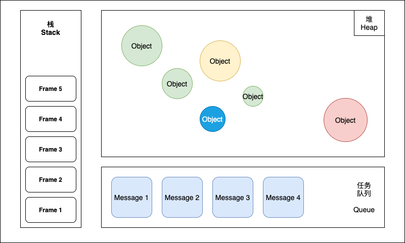
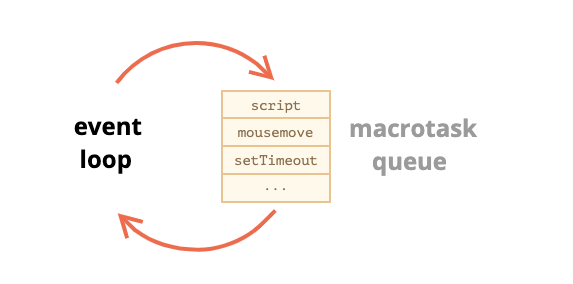
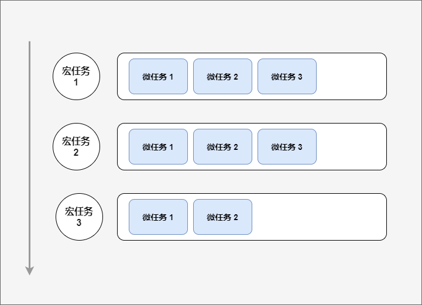

当拿到一段JavaScript代码时，JavaScript引擎便开始执行。但是，这个执行过程并不是一蹴而就的，当宿主遇到一些特殊事件时，会继续把一段代码传递给它，去执行。此外，我们还可能提供API给JavaScript引擎，比如`setTimeout`这样的API，它允许JavaScript引擎在特定时机执行。

所以，我们应该形成一个感性认识：**一个JavaScript引擎会常驻于内存中，它会一直等待宿主把代码传递给它执行。**

# 事件循环
## 数据结构
### 栈  
函数调用形成的一个由若干帧组成的指令序列，符合“后进先出”的特点。例如下面这段代码
```js

    function foo(b) {
        let a = 10;
        return a + b + 11;
    }

    function bar(x) {
        let y = 3;
        return foo(x * y);
    }

    console.log(bar(7)); // 返回 42

```
当调用 bar 时，第一个帧被创建并压入栈中，帧中包含了 bar 的参数和局部变量。
当 bar 调用 foo 时，第二个帧被创建并被压入栈中，放在第一个帧之上，帧中包含 foo 的参数和局部变量。
当 foo 执行完毕然后返回时，第二个帧就被弹出栈（剩下 bar 函数的调用帧 ）。当 bar 也执行完毕并返回时，第一个帧也被弹出，栈就被清空了。

### 堆
对象被分配在堆中，是用来表示一大块内存区域的计算机术语。



## 机制
### 任务队列
把所有待处理的任务统统排入一个队列中，按照“先进先出”的顺序调度执行。这里的任务包括用户主动操作，比如按键、滚动等，也包括I/O，异步函数的回调，等等。

每个任务执行完毕后，后面的任务才能被执行。很明显，一个明显的缺点在于，当一个任务需要花费大量时间才能执行完毕时，应用程序就无法处理与用户的交互，例如点击或滚动。

为了解决这个问题，浏览器一般会弹出一个“这个脚本运行时间过长”的对话框，提示用户通过关闭网页杀死当前进程。所以，为了避免这种现象，最好通过优化尽可能减少程序的运行时间。

### 事件循环
所谓事件循环，就是JavaScript引擎会无休止地运行着，等待各种事件的到来。当接收到事件，如果引擎空闲着，则直接运行。否则，就需要一个“事件队列”把所有待执行的任务排列起来，待引擎执行完前面的任务，再取出事件队列中的第一个任务，执行。这样，直到任务队列变空为止。



算法其实非常简单，按照下面的逻辑执行。

1. 如果任务队列非空，则取出第一个任务，执行；
2. 等待新任务，然后转向 **1**。

用代码表示如下：
```c

    while (queue.waitForMessage()) {
        queue.processNextMessage();
    }

```

### 同步任务和异步任务
我们都知道，JavaScript引擎是单线程运行机制，这就造成一个严重的问题：因为等待临界资源而浪费CPU资源，比如由于等待I/O而阻塞了主线程上的其他任务。

对于这一问题，JavaScript的设计者们意识到，这时候完全可以不用管I/O任务，挂起处于等待中的任务，先执行排在后面的任务，等到IO任务完成时，再回来执行挂起的任务，这不更好吗？

于是，把所有任务分成两种：
* 同步任务。在主线程上排队执行的任务，前一个任务执行完毕，后一个任务才能执行，用一个“执行栈”维持顺序；
* 异步任务。不进入主线程，进入"任务队列"（task queue）的任务，只有"任务队列"通知主线程，某个异步任务可以执行了，该任务才会进入主线程执行。


### 回调函数
所谓“回调函数”，就是那些会被主线程挂起、等任务执行完毕再进入主线程执行栈的代码。异步任务必须指定回调函数，当主线程开始执行异步任务，就是执行对应的回调函数。

这样，**JavaScript引擎把所有任务分为同步任务和异步任务，主线程只执行来自执行栈的同步任务，而把带有回调函数的异步任务排入“任务队列”中，等执行栈一清空，"任务队列"里第一个事件就自动进入主线程执行，然后在合适的时机再执行它的回调函数的过程和机制，就是JavaScript事件循环的核心内容，它让JavaScript即使只支持单线程，也能永不阻塞**。


在上图中，当JavaScript引擎开始运行时，产生堆（heap）、栈（stack）和任务队列。堆中保存着所有对象资源，栈中主要保存着的所有在同步任务，"任务队列"中将加入各种事件（click，load，done）和宿主级别的任务。只要栈中的代码执行完毕，主线程就会去读取"任务队列"中的任务，在合适的时机再依次执行那些事件所对应的回调函数。

# 执行机制

经过上面的解释，我们知道JavaScript事件循环基本就是反复“等待-执行”。但实际上，这里的每次执行过程，其实只是一个**宏观任务**。

## 宏观任务
何谓宏观任务？它大致相当于事件循环，但又不全是；准确讲，是由宿主发起的任务。

在每一个宏观任务中，都包含了一个微观任务队列，用来组织前面提到的各种同步任务和异步任务。一个宏观任务完成之后，才能执行下一个宏观任务。宏观任务主要通过下面这些操作创建：
- `setTimeout`
- `setInterval`
- `setImmediate`
- `requestAnimationFrame`
- I/O
- UI rendering

### 微观任务
一个宏观任务中的所有任务都是微观任务，主要是通过Promise创建的异步任务。另外，还可以通过[queueMicrotask](https://developer.mozilla.org/zh-CN/docs/Web/API/WindowOrWorkerGlobalScope/queueMicrotask)、[MutationObserver](https://developer.mozilla.org/zh-CN/docs/Web/API/MutationObserver)创建，node的[process.nextTick](https://nodejs.org/uk/docs/guides/event-loop-timers-and-nexttick/)也可以。



有了宏观任务和微观任务机制，我们就可以分别实现宿主级别和JavaScript引擎级别的任务了，比如`setTimeout`等宿主API会添加宏观任务，而Promise只在当前宏观任务中添加微观任务，这有助于我们理解一些特殊的代码执行逻辑。

## Promise
Promise是JavaScript提供的一种标准化的异步管理方式，它的主要思想是，在需要进行IO、等待或者其它异步操作时，不返回真实结果，而返回一个**承诺**。函数的调用方可以在合适的时机，选择等待并兑现这个承诺（通过Promise的`then`方法的回调）。
```js

    var r = new Promise(function(resolve, reject){
        console.log("a");
        resolve()
    });
    r.then(() => console.log("c"));
    console.log("b")

```
执行这段代码，得到的结果是：`a b c`。

在进入 `console.log("b")` 之前， `r` 已经得到了`resolve`，但是Promise中的 `resolve` 始终是异步操作，先会加入任务队列中，等到**执行栈**清空之后，才会真正执行 `resolve`，因此， `c` 在最后被执行。

接下来，加入宿主API`setTimeout`，看看能发现什么新东西。

```js

    var r = new Promise(function(resolve, reject){
        console.log("a");
        resolve()
    });
    setTimeout(()=>console.log("d"), 0)
    r.then(() => console.log("c"));
    console.log("b")

```
我们发现，无论在那种浏览器中， `d` 都在 `c` 之后执行。

这是因为，Promise发起的是JavaScript引擎级别的微任务，它依附于当前宏任务，会优先执行；而`setTimeout`是浏览器API，是由宿主发起的，是一个宏任务，在当前宏任务完成之后才开始执行。

下面是一个小实验，先执行一个耗时操作，再提交Promise。
```js

    setTimeout(()=>console.log("d"), 0)
    var r1 = new Promise(function(resolve, reject){
        resolve()
    });
    r.then(() => { 
        var begin = Date.now();
        while(Date.now() - begin < 1000);
        console.log("c1") 
        new Promise(function(resolve, reject){
            resolve()
        }).then(() => console.log("c2"))
    });

```
经过执行后发现，即使是延时1秒提交Promise， `d` 依然是最后被执行的，这很好地解释了**微任务优先执行**的代码执行机制。

经过这些实验可知，JavaScript代码的执行机制为：

1. 分析有多少个宏任务；
2. 在每个宏任务中，分析有多少个微任务；
3. 根据微任务的调用次序，确定每个宏任务中的微任务执行次序；
4. 根据宏任务的触发规则和调用次序，确定宏任务的执行次序；
5. 按上面确定好的次序，依次执行。

## `async/await`
 `async/await` 是ES2016加入的新特性，以此可以为for、if等代码结构编写异步代码，它的运行时基础是Promise。

 在function前加上 `async` ，函数就会变成异步函数，返回Promise，还可以在 `async` 函数中用 `await` 来等待一个Promise。这样，便可以想编写同步代码一样，编写异步代码。

 ```js

    function sleep(duration) {
        return new Promise(function(resolve, reject) {
            setTimeout(resolve,duration);
        })
    }
    async function foo(){
        console.log("a")
        await sleep(2000)
        console.log("b")
    }

 ``` 
 并且，`async/await` 还可以嵌套，这才是最强大的地方。
 ```js

    function sleep(duration) {
        return new Promise(function(resolve, reject) {
            setTimeout(resolve,duration);
        })
    }
    async function foo(name){
        await sleep(2000)
        console.log(name)
    }
    async function foo2(){
        await foo("a");
        await foo("b");
    }
    
 ```