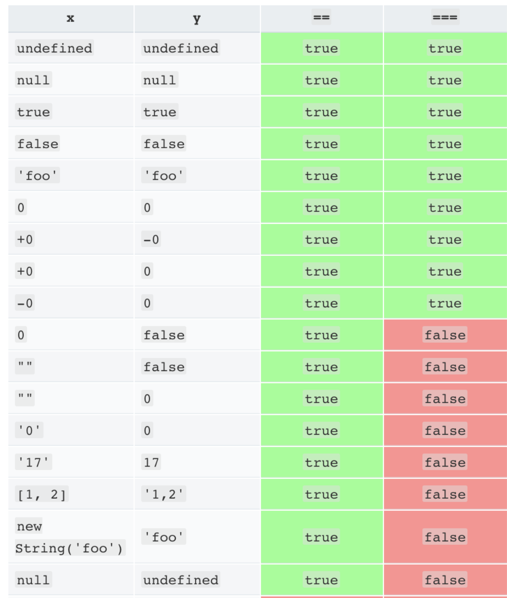

# Index

1. `{ }`在JavaScript中的用法;
2. 为什么JavaScript是单线程的？
3. `==` 和 `===` 的区别在哪里？
4. `typeof` 和 `instanceof`的区别是什么？

# 1.`{ }`在JavaScript中的用法
## Q：

既然函数是对象，那么在函数对象内部，就应该可以使用键值对添加属性和方法，但实际上并不会有任何效果。

```js
function Person(name, gender) {
    this.name = name;
    this.gender = gender;
    age: 20; // 用键值对添加属性
}
var p = new Person("Walker", "male")
var p = Person {name: "Walker", gender: "male"}
p.age // undefined
```

## A：

JavaScript里，一对花括号`{ }`实际上有下面三种作用：
- 可以在函数声明/函数表达式中用于括住函数体。如问题所示；
- 可以是块语句（block statement）用于把若干语句打包为一块，例如用于`while`、`for`等控制流语句中；
- 可以是对象字面量（Object Literal；或者叫对象初始化器，Object Initializer）。如问题中强行添加的`age`属性。

实际上，下面这两种写法所生成的AST完全不同。
```js
// 1
function Person(name, gender) {
    this.name = name;
    this.gender = gender;
}
// 2
var person = {
    name : "walker",
    gender: "male"
}
```

通过[esprima](https://esprima.org/demo/parse.html)查看不同代码的AST：
- [函数Person的AST](https://esprima.org/demo/parse.html?code=%2F%2F%20Life%2C%20Universe%2C%20and%20Everything%0Afunction%20Person(name%2C%20gender)%20%7B%0A%20%20%20%20this.name%20%3D%20name%3B%0A%20%20%20%20this.gender%20%3D%20gender%3B%0A%20%20%20%20age%3A%2020%3B%20%2F%2F%20%E7%94%A8%E9%94%AE%E5%80%BC%E5%AF%B9%E6%B7%BB%E5%8A%A0%E5%B1%9E%E6%80%A7%0A%7D)
- [直接量Person的AST](https://esprima.org/demo/parse.html?code=%2F%2F%20Life%2C%20Universe%2C%20and%20Everything%0Avar%20person%20%3D%20%7B%0A%20%20%20%20name%20%3A%20%22walker%22%2C%0A%20%20%20%20gender%3A%20%22male%22%0A%7D)

# 2.为什么JavaScript是单线程的？
## Q:

为什么JavaScript没有选择使用多线程充分利用机器的性能，而是只用单线程呢？

## A:

>JavaScript的单线程，与它的用途有关。作为浏览器脚本语言，JavaScript的主要用途是与用户互动，以及操作DOM。这决定了它只能是单线程，否则会带来很复杂的同步问题。比如，假定JavaScript同时有两个线程，一个线程在某个DOM节点上添加内容，另一个线程删除了这个节点，这时浏览器应该以哪个线程为准？
>
>所以，为了避免复杂性，从一诞生，JavaScript就是单线程，这已经成了这门语言的核心特征，将来也不会改变。
>
>为了利用多核CPU的计算能力，HTML5提出Web Worker标准，允许JavaScript脚本创建多个线程，但是子线程完全受主线程控制，且不得操作DOM。所以，这个新标准并没有改变JavaScript单线程的本质。

实际上，跟GUI相关的框架（QT、GTK、MFC、Android、iOS）采用的全是这种模型，所有跟UI相关的操作，就像浏览器中的DOM操作一样，必须在单线程（在很多GUI框架中称为主线程）中执行。因为只有这样，才能保证数据的一致性，才能构架一个稳定可用的系统。

# 3. `==` VS `===`
## Q:

抽象（非严格）相等比较 `==` 和 严格相等比较 `===` 是如何运行的，才造成如此差异？

## A:
### 非严格相等比较 `==`
`==` 在进行比较时，先会进行类型转换，将两边的值转换为相同类型，主要是通过`ToNumber`和`ToPrimitive`，然后再做比较。具体而言，按照下面的规则进行转换：
- `undefined`与`null`相等；
- 字符串和`bool`都转为数字再比较；
- 对象转换成`primitive`类型再比较。
- 对象如果转换成了primitive类型后，如果跟等号另一边类型恰好相同，则不需要再转换成数字。

这样，就可以理解一些反直觉的案例。



### 严格相等比较 `===`
严格相等比较更符合实际工作需要，在比较时并不进行隐式转换。所以如果两个值的类型不同，那么就不全等；而如果两个被比较的值类型相同，值也相同，则两个值全等。具体比较规则如下：
- 两个字符串相同，当且仅当字符序列相同，长度也相同。
- 两个number相同，当且仅当其数值相同；`NaN`和任何值都不相同，包括NaN。
- 两个Boolean相同，当且仅当同时为`true`或者`false`。
- 两个Object相同，当且仅当它们同时引用自同一个对象。

# 4. `typeof` VS `instanceof`
## Q:

typeof和instanceof有哪些区别，分别适用于哪些场景？

## A:
### typeof

typeof返回一个字符串，表示操作数的基本类型信息。截止ES2020，JavaScript更有8种基本类型，分别如下：
- Undefined，返回`"undefined"`
- Null，返回"`object"`，
- Number，返回`"number"`
- Boolean，返回`"boolean"`
- String，返回`"string"`
- Object，返回`"object"`
- Symbol，ES6新加入，返回`"symbol"`
- BigInt，ES2020加入的，返回`"bigint"`

这里，**最出乎意料的是`Null`返回`"object"`**，这是因为自JavaScript诞生以来，就是如此。后来有提案建议修复这种bug，但是被拒绝了，主要是为了兼容以前的项目。


### instanceof

`instanceof`用于检测一个实例是否属于某个类或者继承自此类，在细节上是通过检测右侧构造器的`prototype`是否出现在左侧实例对象的原型链中。主要为对象Object的实例服务，更进一步是为**普通对象**服务的。

JavaScript中的对象可以分为两类：
- 宿主对象，由宿主环境提供，行为也由宿主决定。
- 内置对象，JavaScript提供的对象，除宿主对象之外的所有对象。
  - 固有对象，由标准规定，随着JavaScript运行时被创建而创建的对象。
  - 原生对象，用户通过`Array`、`Date`、`RegExp`等构造器创建的对象。
  - 普通对象，用户自定义的对象，通过`{ },` `function`、`class`等创建的对象。

```js
class A {}
function B() {}

let a = new A()
let b = new B()

a instanceof A        // true
a instanceof Object   // true

b instanceof B        // true
b instanceof Object   // true
b instanceof Function // false

A instanceof Function // true
A instanceof Object   // true

B instanceof Function // true
B instanceof Object   // true

[] instanceof Array   // true

let now = new Date()

now instanceof Date   // true
now instanceof Object // true
```

在实现细节上，是通过检测一步步检测原型链来完成的。
```js
obj.__proto__ === Class.prototype?
obj.__proto__.__proto__ === Class.prototype?
obj.__proto__.__proto__.__proto__ === Class.prototype?
```
